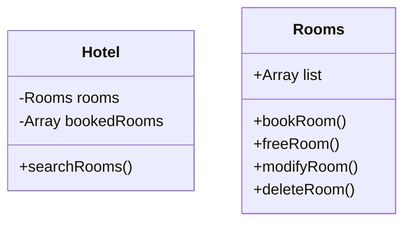
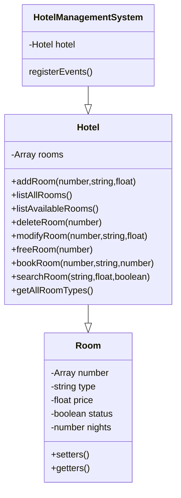

# Hotel System Management

Cette semaine, on m'a confié deux développeurs frontend d'application JavaScript
débutants afin de réaliser l'application de la gestion des chambres d'un hôtel.

## Groupe

1. Chef d'équipe : `M.`
2. Développeuse  : `C.`
3. Designer      : `S.`

## Fonctionnalités

1. [x] L'ajout d'une chambre
2. [x] La modification d'une chambre
3. [x] La suppression d'une chambre
4. [x] La réservation d'une chambre
5. [x] La libération d'une chambre
6. [x] La recherche d'une chambre en fonction d'un prix max et d'un type (réservé ou non)
7. [x] Lister toutes les chambres disponibles et réservés de l'hôtel
8. [x] Lister toutes les chambres disponibles de l'hôtel

## Le schéma

La première tâche que je leur ai demandé à tous les deux était de me fournir un
schéma dans lequel doit être détaillé les différentes propriétés et les
différentes actions de ces fonctionnalités ci-haut. Le challenge pour eux est de
s'imaginer comment fonctionne un hotel dans la vraie vie, quelles sont les
propriétés que l'on pourrait avoir besoin dans le cadre de cette application et
comment peut-on les retranscrire en codage JavaScript.

Seule `C.` a réussi à me produire un schéma de classes. Son schéma de classes
comportait 2 classes :

Son schéma était correcte mais pouvait être amélioré. J'ai donc décidé de
consulter `C.` et lui proposer de réfléchir ensemble à un nouveau en partant de
l'existant. Avec beaucoup d'échanges, nous avons convenu à un schéma en commun
:

## UI

`C.` a pris l'initiative de créer son propre HTML et CSS.

N'étant pas très bons en design nous avons opté pour une solution de facilité et
de démo, qu'est Bootstrap.

Nous n'avons pas beaucoup de temps à accorder aux design de l'application.
Il s'agit d'un simple exercice de groupes, pas d'un réel projet.

`S.` a pris l'initiative de faire le design de l'application afin de le rendre
visuellement plus attrayant que la version bootstrap.

Nous avons opté de choisir la version de `S.` car elle est vraiment cool.

## Implémentation

J'ai demandé à `C.` de créer les classes correspondantes aux schémas qu'on a
établie, elle est l'a fait avec brio.

Étant donné que `S.` n'était pas en bonne forme, j'ai pris l'initiative de de
connecter les boutons et les formulaires aux JavaScript et de transmettre les
données aux méthodes de classes qu'à précédemment crée `C.` et d'afficher les
données que me retournent les méthodes de classes de `C.` dans le DOM.

